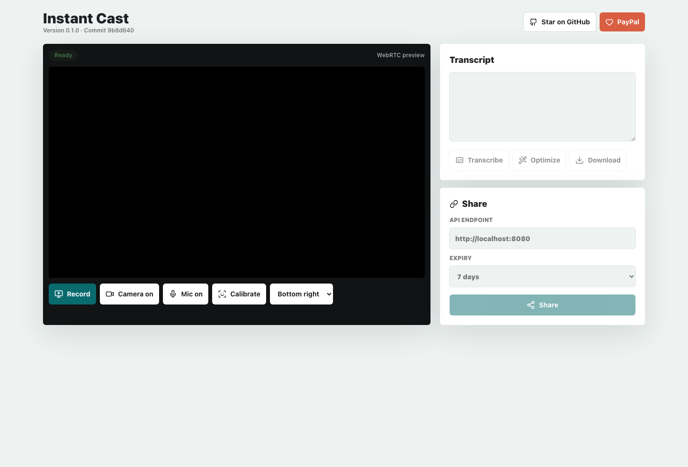
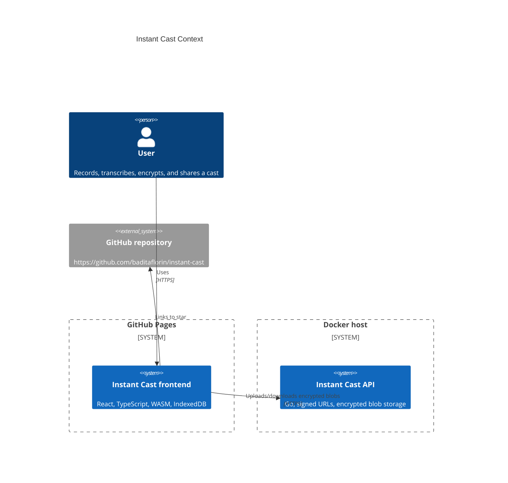

# Instant Cast


Live site: https://baditaflorin.github.io/instant-cast/

Repository: https://github.com/baditaflorin/instant-cast

Support: https://www.paypal.com/paypalme/florinbadita

Instant Cast is a no-account screen recorder with webcam overlay, on-device transcription, age encryption, and signed expiring share links.



## Quickstart

```sh
npm install
make install-hooks
make dev
```

## Verified Features

- Screen recording with webcam overlay through WebRTC browser APIs.
- Local transcript generation through lazy-loaded Whisper in `@huggingface/transformers`.
- Client-side `.age` encryption before uploads using `age-encryption`.
- Signed anonymous upload/download API in Go; plaintext recordings never reach the backend.
- Local state export/import through a versioned JSON file.
- State restore from IndexedDB after reload.
- Drag/drop, file picker, clipboard, and paste-box input for exported state and Instant Cast share URLs.
- GitHub Pages build in `docs/`, with version and commit visible in the UI.

## Limitations

- Hosted sharing requires a deployed backend URL; the GitHub Pages frontend cannot accept uploads by itself.
- Public Pages cannot use `http://localhost:8080` as a share backend. Use local download/export or deploy the Docker backend.
- Browser screen capture support varies by browser and operating system.
- State JSON includes base64 media and can become large. Use video download for very large recordings.
- Whisper, FFmpeg, MediaPipe, and age modules are lazy-loaded WASM/JS chunks; first use can take longer on slow networks.

## Architecture



Architecture docs: docs/architecture.md

ADRs: docs/adr/

Backend deploy guide: deploy/README.md

API examples: docs/api.md

## Development

```sh
make help
make test
make build
make smoke
```

## Release

```sh
make docker-push
make release
```
