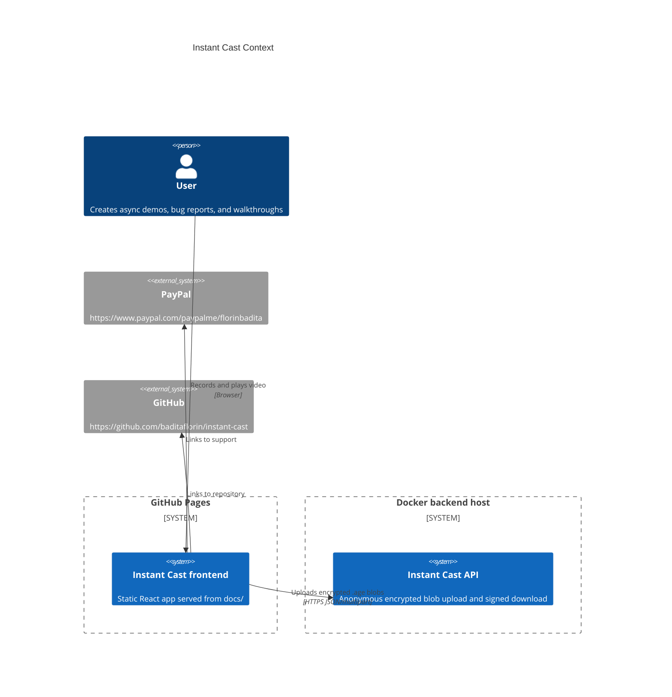
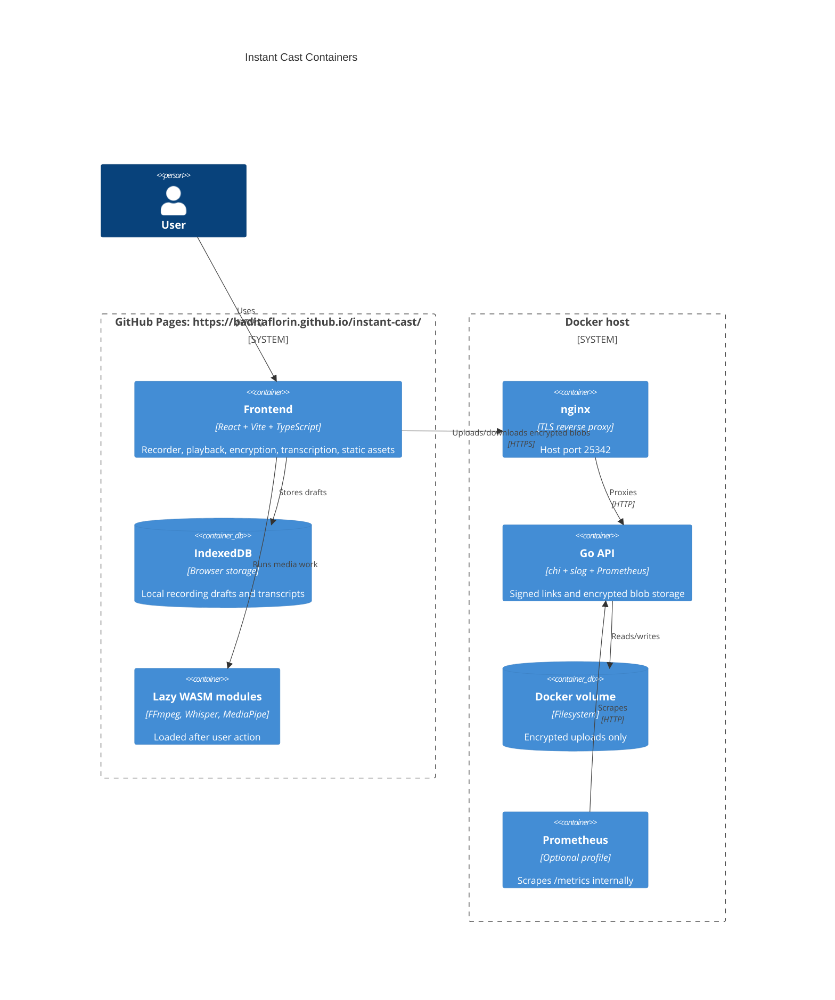

# Architecture

Live site: https://baditaflorin.github.io/instant-cast/

Repository: https://github.com/baditaflorin/instant-cast

## Context

## Containers

## Boundaries

- Frontend owns capture, compositing, transcription, FFmpeg export, age encryption, decryption, and playback.
- Backend owns upload limits, signed token validation, expiry, encrypted blob storage, health, readiness, and metrics.
- Backend never receives plaintext recordings or decryption keys.
- URL fragments carry age passphrases so keys are not sent to the server.
